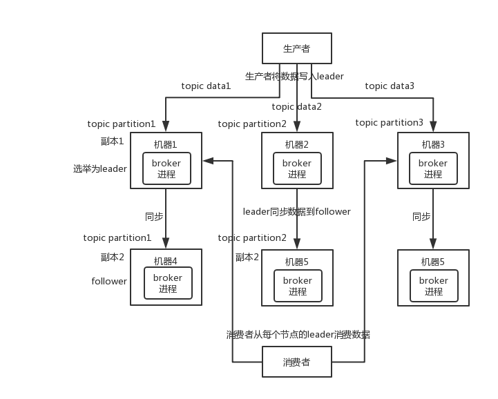

#### 1、RabbitMQ

`RabbitMQ`有三种模式：单机模式、普通集群模式以及镜像集群模式

普通集群模式：提高`Queue`的数据吞吐量，并不能保证高可用；工作原理：每台机器都会启动一个`RabbitMQ`实例，创建的`Queue`会保存在某一个`RabbitMQ`实例，其它实例会同步保存`Queue`元数据（创建`Queue`的配置信息，可以找到`Queue`所在实例位置）；当消费请求到另外一个实例时，会拉取`Queue`所在实例上的数据。

镜像集群模式：保证高可用，普通集群模式升级版本；工作原理：现在每个`RabbitMQ`同步`Queue`元数据与消费数据，生产者写数据到`Queue`会将数据同步到每个实例上去。缺点：网络带宽开销大，不是分布式服务

#### 2、Kafka

`Kafka`由多个`broker`节点组成；创建一个`topic`，可以划分成多个`partition`，可以分布在多个`broker`节点上，每个`partition`存在一部分数据。`topic`数据可以拆分分布到不同的机器上，就是一个分布式消息队列。（分布式 - 你中有我，我中有他）

`Kafka 0.8`之后，引入`HA`机制（`High Availability`）；一个`partition`可以同步多个`replica`副本到不同机器上，此时`partition`为`leader`，其它副本为`follower`，读写过程只会发生在`leader`上，保证主从数据一致性；当某一`leader`所在节点宕机，会重新推选一个`follower`为新的`leader`

